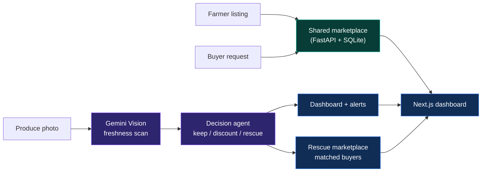

<div align="center">

# 🥦 FreshGuard AI

**Catch the spoilage before it becomes waste — and turn the harvest into a deal.**

[](./backend)
[](./frontend)
[](https://ai.google.dev/)
[](https://www.sqlalchemy.org/)
[](./backend/auth.py)

*An AI freshness inspector for your produce, and a marketplace connecting the farmers who grow it to the buyers who need it.*

[Features](#-what-freshguard-does) · [Architecture](#-architecture) · [Run it locally](#️-run-it-locally) · [API reference](#-api-reference) · [Roadmap](#-roadmap)

</div>

---

## The problem

Produce spoils fast, and by the time it's visibly bad, it's already unsellable. Meanwhile, farmers with a fresh harvest and retailers looking to buy often never find each other in time.

> **A photo tells you a fruit is fine. FreshGuard tells you it has 2 days left, who to sell it to at a discount before it turns, and who's already looking to buy your next harvest.**

FreshGuard combines an AI vision inspector with a two-sided produce marketplace — so nothing that's still good goes to waste, and nothing that's already grown goes unsold.

---

## ✦ What FreshGuard does

| Capability | What happens |
|---|---|
| **AI Freshness Scan** | Upload a photo of any produce item. Gemini Vision grades it against an explicit freshness rubric — score (0–100), estimated shelf life, and visible defects — no image is stored, only the analysis. |
| **Decision Agent** | Every scan is automatically turned into a recommendation: keep, discount, or rescue, based on the freshness score and shelf life. |
| **Dashboard & Alerts** | Track total scans, average freshness, waste saved, and a critical-item alert feed so nothing near-spoiling slips by unnoticed. |
| **Rescue Marketplace** | Batches flagged as near-expiry are matched against nearby NGOs, restaurants, and retailers who can take them at a discount instead of the bin. |
| **Farmer Listings** | Farmers post what they're growing — crop, quantity, variety, contact details — into a live marketplace buyers can browse. |
| **Buyer Requests** | Retailers and businesses post what they want to buy and how much, so farmers know exactly who's looking before the harvest is even in. |
| **AI Copilot** | A built-in chat assistant for quick questions about your scans and produce, without leaving the app. |

---

## ✦ Architecture



### How a photo becomes a decision

1. **Upload** — a produce photo is sent inline (base64) to Gemini Vision, never stored on disk.
2. **Grade** — a rubric-based prompt scores freshness 0–100 across explicit visual criteria, at low temperature for consistent results.
3. **Decide** — the freshness score and shelf-life estimate feed a local decision agent that recommends keep, discount, or rescue.
4. **Act** — critical items surface as alerts and, if near-expiry, get matched to marketplace buyers automatically.

### How a harvest finds a buyer

1. A farmer posts a listing — crop, quantity, variety, contact info.
2. A retailer posts a request — crop, quantity needed, company info.
3. Both live on a shared, authenticated marketplace page, browsable by anyone logged in.

---

## Tech stack

| Layer | Technology |
|---|---|
| Frontend | Next.js, React, TypeScript, Tailwind CSS, SWR |
| API | FastAPI, Python, Pydantic |
| Auth | JWT (python-jose), bcrypt password hashing |
| Vision AI | Google Gemini Vision (`google-generativeai`) |
| Database | SQLAlchemy ORM over SQLite (dev) |
| Rate limiting | SlowAPI |
| Hosting target | Google Cloud |

---

## ▶️ Run it locally

### Prerequisites

- Python 3.10+
- Node.js 18+
- A [Gemini API key](https://aistudio.google.com/app/apikey)

### 1. Clone the project

```bash
git clone https://github.com/<your-username>/freshguard.git
cd freshguard
```

### 2. Start the backend

```bash
cd backend
python -m venv .venv
```

Activate the environment:

```bash
# macOS / Linux
source .venv/bin/activate

# Windows PowerShell
.venv\Scripts\Activate.ps1
```

Install dependencies:

```bash
pip install -r requirements.txt
```

Create `backend/.env`:

```env
SECRET_KEY=your_own_secret_key
GEMINI_API_KEY=your_gemini_api_key
```

Start the API:

```bash
uvicorn main:app --reload
```

The API is now available at `http://localhost:8000`; interactive docs at `http://localhost:8000/docs`.

### 3. Start the frontend

Open a second terminal:

```bash
cd frontend
npm install
```

Create `frontend/.env.local`:

```env
NEXT_PUBLIC_API_URL=http://localhost:8000
```

```bash
npm run dev
```

The app is now available at `http://localhost:3000`.

---

## ↗ API reference

| Method | Endpoint | Purpose |
|---|---|---|
| `POST` | `/auth/signup` | Create an account, returns a JWT |
| `POST` | `/auth/login` | Authenticate, returns a JWT |
| `GET` | `/auth/me` | Return the current authenticated user |
| `POST` | `/scan/analyze` | Upload a produce photo, get a freshness analysis |
| `GET` | `/scan/history` | Return the user's recent scans |
| `GET` | `/dashboard/summary` | Aggregated analytics for the logged-in user |
| `GET` | `/alerts/critical` | Near-spoiling items needing attention |
| `GET` | `/rescue/matches` | Near-expiry scans matched to potential buyers |
| `POST` | `/farmer/listings` | Post a crop-for-sale listing |
| `GET` | `/farmer/listings` | Browse all farmer listings |
| `POST` | `/buyer/requests` | Post a crop-buying request |
| `GET` | `/buyer/requests` | Browse all buyer requests |

Example scan request:

```bash
curl -X POST http://localhost:8000/scan/analyze \
  -H "Authorization: Bearer <token>" \
  -F "file=@tomato.jpg"
```

---

## Repository map

```text
freshguard/
├── frontend/
│   ├── app/                    # Next.js app router pages
│   └── components/             # Scan, dashboard, rescue, farmer, buyer, copilot UI
├── backend/
│   ├── routers/
│   │   ├── auth.py             # Signup / login / current user
│   │   ├── scan.py             # Gemini Vision freshness analysis
│   │   ├── dashboard.py        # Analytics summary
│   │   ├── alerts.py           # Critical item alerts
│   │   ├── rescue.py           # Near-expiry buyer matching
│   │   ├── copilot.py          # AI chat assistant
│   │   ├── farmer.py           # Crop-for-sale listings
│   │   └── buyer.py            # Crop-buying requests
│   ├── models.py                # SQLAlchemy models
│   ├── schemas.py                # Pydantic request/response schemas
│   ├── decision_agent.py         # Freshness → recommendation logic
│   ├── mock_buyers.py            # Sample rescue-marketplace buyers
│   ├── database.py               # SQLite/SQLAlchemy setup
│   ├── auth.py                   # JWT + password hashing helpers
│   └── main.py                   # FastAPI app entrypoint
└── README.md
```

---

## Security notes

- Keep `SECRET_KEY` and `GEMINI_API_KEY` in `.env`; never commit them.
- CORS is restricted to a known frontend origin — update it to your real domain before deploying, and never open it to `*` on an authenticated API.
- Uploaded produce photos are analyzed in memory and discarded, never written to disk or a database.
- Marketplace contact details (phone, address) are visible to any logged-in user by design — let users know before they post.
- Run behind HTTPS in production; SQLite is for local development, not concurrent production traffic.

---

## Roadmap

- [ ] Auto-match farmer listings to buyer requests by crop and location
- [ ] "My Listings" view with edit/delete for a user's own posts
- [ ] Price field and a simple offer flow on both marketplace sides
- [ ] Search and filter by crop category (fruit/vegetable) and location
- [ ] Photo attachment on farmer listings
- [ ] Tie a listing to a real freshness scan instead of a text description
- [ ] Real buyer matching for Rescue instead of the current mock buyer list

---

<div align="center">

### Built to catch the spoilage before it's waste — and the harvest before it's missed.

</div>
